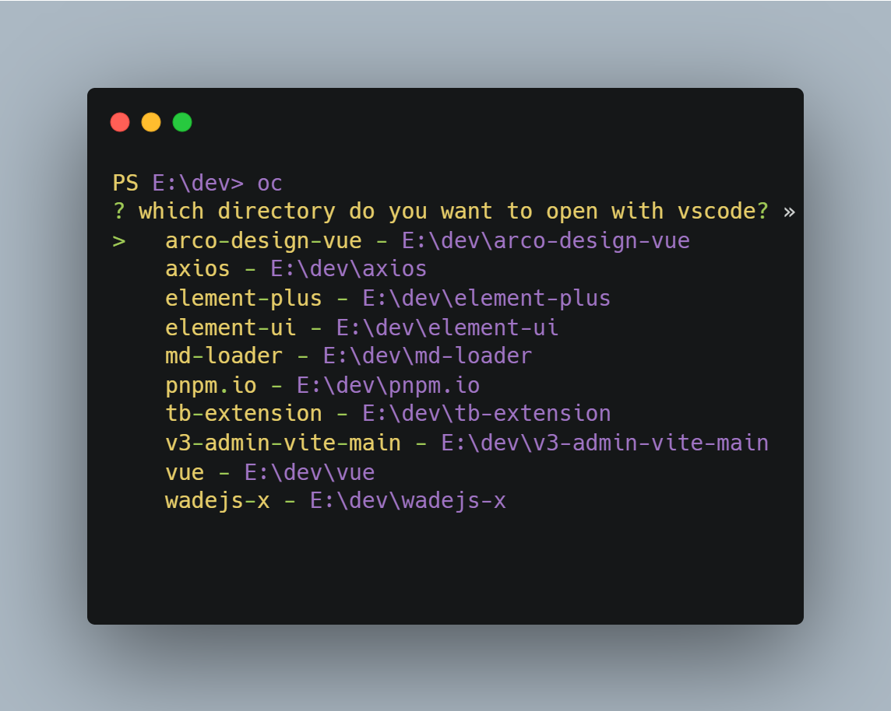

<h1 align="center">open-in-vscode</h1>
<p align="center">A cli used to open in vscode at the specified path</p>

## Usage

```sh
oc
```

<p align='center'>

</p>

## Features

```sh
oc add # add a directory to the directory list
oc del # delete the useless path from the directoryList
oc alias # add an alias for the specified directory
oc config # show config
```
